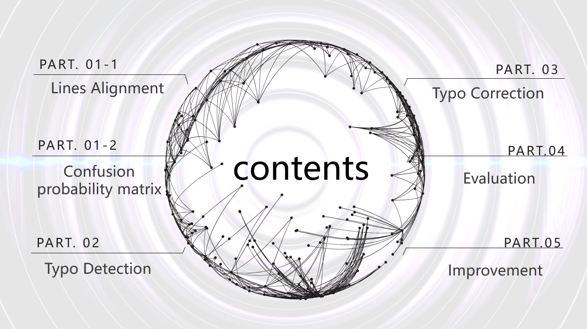

# Project: OCR (Optical Character Recognition) 


### [Full Project Description](doc/project4_desc.md)

Term: Fall 2018

+ Team #2
+ Team members
	+ Ghada Jerfel 
	+ Peilin Li
	+ Xiaoyi Li
	+ Hengyang Lin
	+ Zhibo Zhou

+ Project summary: In this project, we created an OCR post-processing procedure to enhance Tesseract OCR output. There are four parts in our project. The first one is Lines alignment and computing confusion probability matrix. We make sure that lines are corresponded, and use tokens with same length which make characters paired to compute ratio of number of letter_i printed by OCR over number of letter_j in ground truth. The second part is typo detection；there are 8 rules that we used as our algorithm based on paper D1 section 2.2. We personally add one more rule: Detect all words with a consonant followed by letter "l" as garbage words, which is a important feature of garbage words we found in tesseract. The third part is typo correction. Here，we first propose candidates for garbage words, next we compute a score for each candidate based on both topic model probability from that document's clean words and confusion probability, and last we correct the word with the one that has the highest scores. The fourth step is performance measurement. We perfrom both word wise evaluation which is sensitive to upper case letters, and character wise evaluation which is sensitive to upper case letters and considers orders of letters. The fifth parth is improvement, which is to use iteration to improve correction. If a file was processed, then the processed file contains more correct words, which help to improve the topic model part, which means we could perform a new round of detection and correction on the processed file.

	
**Contribution statement**: 
+ Project Leader：
  + Hengyang Lin: Designed and organized the structure of the whole project. Built "Computation of confusion probability matrix" part, "Typo detection" part, "Typo correction" part and "Improvement". Searched different kinds of papers that relate to this project.
  
+ Major contributor:
  + Zhibo Zhou : Designed and wrote "Typo Detection" part and "Lines alignment" part, contributed to "Computation of confusion probability matrix" part. Searched different kinds of papers that relate to this project. Presentation.
  + Peilin Li : Designed and wrote "Typo Detection" part and "Lines alignment" part, contributed to "Computation of confusion probability matrix" part. Searched different kinds of papers relating to those two parts. Scheduled meetings.
  
+ Equal contribution：
  + Ghada Jerfel : Designed and wrote "Performance Measurement" and edited the readme file.
  + Xiaoyi Li: Designed and wrote "Performance Measurement" and edited the readme file.
  


Following [suggestions](http://nicercode.github.io/blog/2013-04-05-projects/) by [RICH FITZJOHN](http://nicercode.github.io/about/#Team) (@richfitz). This folder is orgarnized as follows.

```
proj/
├── lib/
├── data/
├── doc/
├── figs/
└── output/
```

Please see each subfolder for a README file.
